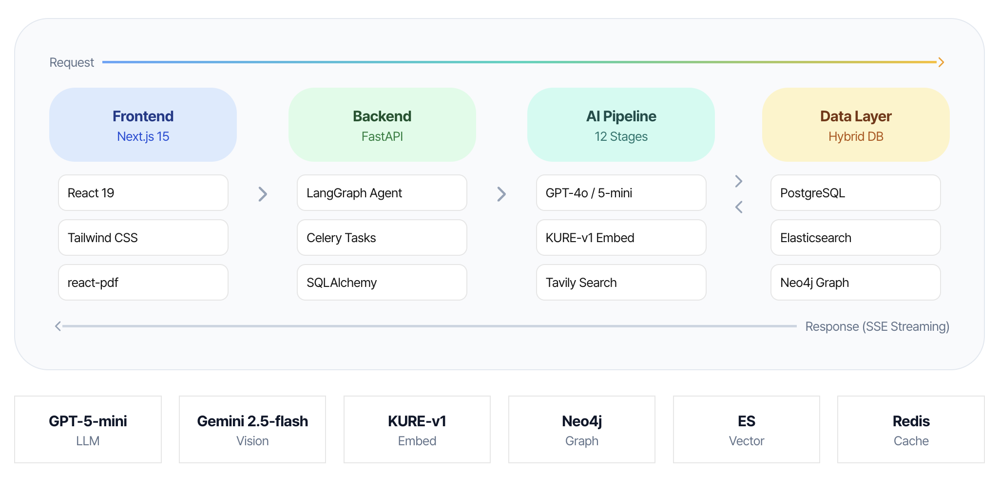
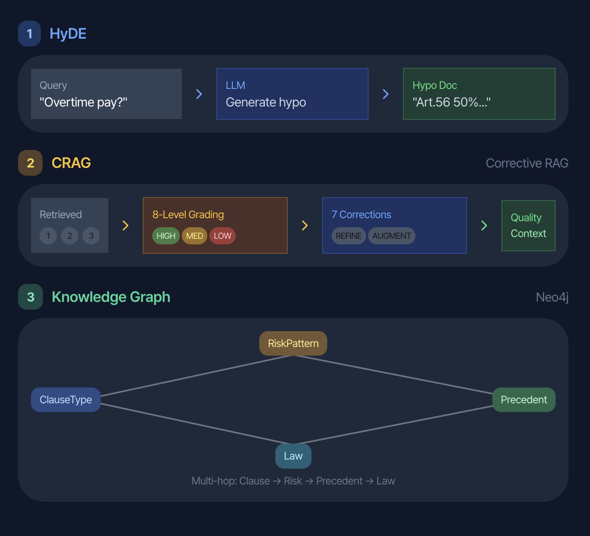
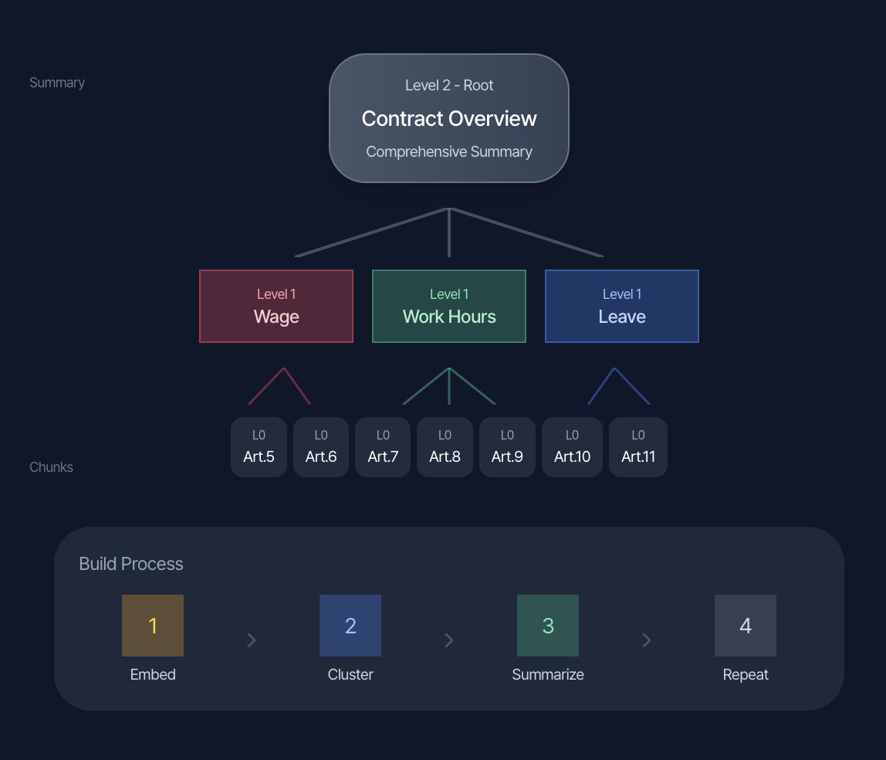
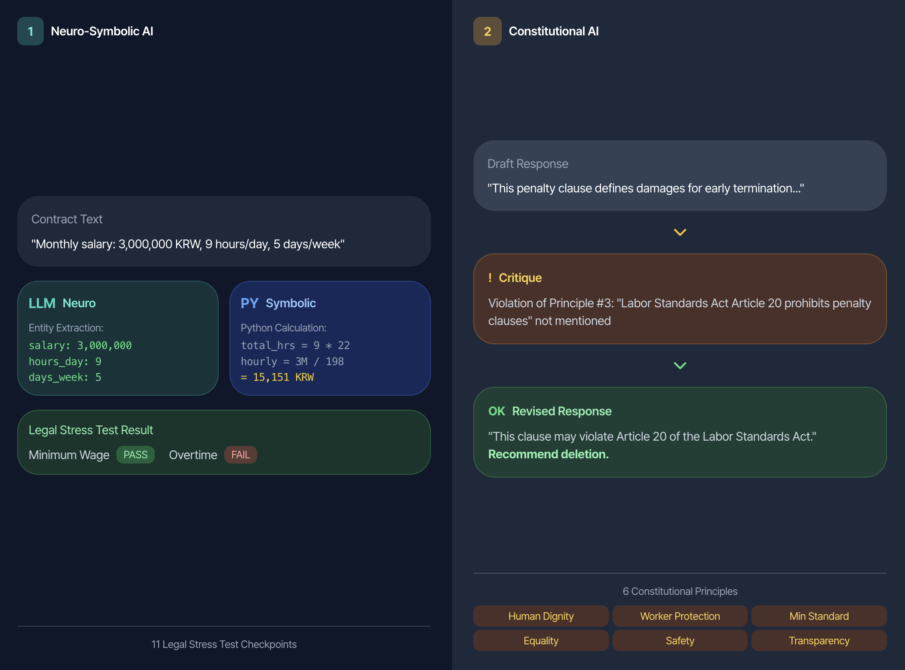
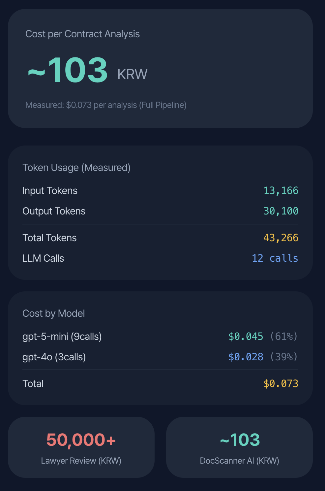

# 고려대학교 산학캡스톤디자인

<div align="center">
<h1>Docscanner.ai</h1>
<p>근로계약서 자동 분석 AI 시스템</p>
</div>

> 개발기간: 2025.10 ~
>
> Built with Python (FastAPI), Next.js, LangGraph

## 프로젝트 개요

DocScanner AI는 근로계약서를 AI로 분석하여 법적 위험 조항을 자동으로 탐지하고, 사용자에게 법적 근거와 함께 개선안을 제시하는 시스템입니다.

### 핵심 목표

1. **정확한 위반 탐지**: LLM 기반 조항 분석으로 정규식 한계 극복
2. **법적 근거 제시**: Vector DB + Graph DB 하이브리드 검색으로 관련 법령/판례 제시
3. **실시간 채팅 지원**: LangGraph 에이전트로 계약서 관련 질문에 실시간 응답
4. **신뢰할 수 있는 분석**: Constitutional AI, LLM-as-a-Judge로 분석 품질 보장

---

## 시스템 아키텍처

Frontend(Next.js)에서 Backend(FastAPI)로 요청이 전달되고, 12단계 AI Pipeline을 거쳐 분석 결과를 SSE 스트리밍으로 반환합니다.

<div align="center">

<p><i>Frontend - Backend - AI Pipeline - Data Layer 구조</i></p>
</div>

---

## 핵심 기술

### 1. HyDE + CRAG + Knowledge Graph

검색 품질을 극대화하기 위한 3단계 검색 강화 파이프라인입니다.

<div align="center">

</div>

| 기술 | 설명 |
|------|------|
| **HyDE** | 사용자 질의를 LLM으로 가상의 법률 문서로 변환하여 검색 정확도 향상 |
| **CRAG** | 검색 결과를 8단계로 품질 평가하고, 7가지 교정 전략 적용 |
| **Knowledge Graph** | Neo4j 기반 멀티홉 검색으로 Clause - Risk - Precedent - Law 연결 |

---

### 2. MUVERA 임베딩

Google Research(NeurIPS 2024)의 Multi-Vector Retrieval 기술을 적용하여 긴 법률 문서의 세부 의미를 보존합니다.

<div align="center">

</div>

**처리 과정:**

1. **Article-based Chunking**: 계약서를 조항 단위로 분할
2. **Sentence Split + KURE-v1**: 문장별로 한국어 법률 특화 모델(KURE-v1)로 임베딩
3. **SimHash Partitioning**: Locality-Sensitive Hashing으로 유사 벡터를 같은 버킷에 할당
4. **FDE Compression**: Multi-vector를 단일 1024차원 벡터로 압축 (의미 보존)

---

### 3. Hybrid DB 검색

Vector DB(Elasticsearch)와 Graph DB(Neo4j)를 결합한 하이브리드 검색으로 정확한 법적 근거를 제공합니다.

<div align="center">

</div>

**검색 흐름:**

1. **Vector DB Search**: 시급, 임금 등 키워드로 의미적 유사도 검색
2. **Graph DB Expansion**: 검색된 판례에서 CITES 관계를 따라 관련 법령/해석례 확장
3. **LLM Analysis**: Vector 5건 + Graph 6건 = 총 11건의 문서로 분석 수행

---

### 4. RAPTOR 계층적 요약

계약서 내용을 트리 구조로 요약하여 다중 레벨 검색을 지원합니다.

<div align="center">

</div>

**트리 구조:**

- **Level 2 (Root)**: 전체 계약서 요약 (Contract Overview)
- **Level 1**: 카테고리별 요약 (Wage, Work Hours, Leave)
- **Level 0**: 원본 조항 청크 (Art.5, Art.6, ...)

**구축 과정**: Embed - Cluster - Summarize - Repeat

---

### 5. Neuro-Symbolic AI + Constitutional AI

LLM의 자연어 이해력과 Python의 정확한 수치 계산을 결합하고, 6가지 노동법 원칙으로 분석 품질을 보장합니다.

<div align="center">

</div>

**Neuro-Symbolic AI (좌측):**

- **LLM (Neuro)**: 계약서에서 급여, 근로시간 등 정보 추출
- **Python (Symbolic)**: 정확한 수치 계산 및 법적 기준 비교
- **11가지 검증 항목**: 최저임금, 연장근로수당, 주휴수당, 연차휴가 등

**Constitutional AI (우측):**

- **6가지 원칙**: Human Dignity, Worker Protection, Min Standard, Equality, Safety, Transparency
- **Critique - Revise 워크플로우**: 원칙 위반 시 자동 수정

---

## 비용 분석

전체 12단계 파이프라인 실행 시 계약서 1건당 약 103원의 비용이 발생합니다.

<div align="center">

</div>

| 항목 | 수치 |
|------|------|
| **계약서당 비용** | ~103 KRW ($0.073) |
| **총 토큰** | 43,266 (Input: 13,166 / Output: 30,100) |
| **LLM 호출** | 12회 |
| **모델별 비용** | gpt-5-mini: $0.045 (61%) / gpt-4o: $0.028 (39%) |

> 변호사 검토 비용(50,000원 이상) 대비 약 500배 저렴

---

## AI 분석 파이프라인 (12단계)

| 단계 | 모듈 | 설명 |
|------|------|------|
| 1 | PII Masking | 개인정보 마스킹 (10종: 주민등록번호, 전화번호, 이메일 등) |
| 2 | Document Parsing | PDF, HWP, DOCX, 이미지 텍스트 추출 |
| 3 | Text Chunking | 텍스트 분할 및 전처리 |
| 4 | HyDE | 가상 문서 생성으로 검색 쿼리 강화 |
| 5 | CRAG | 품질 인식 검색 (8단계 품질 평가 + 7가지 교정 전략) |
| 6 | LLM Clause Analysis | 조항별 위반 분석 (병렬 처리 + 종합 분석) |
| 7 | RAPTOR | 계층적 요약 인덱싱 |
| 8 | Legal Stress Test | Neuro-Symbolic AI 기반 정량적 법적 검증 (11종) |
| 9 | Generative Redlining | 법적으로 안전한 수정안 자동 생성 |
| 10 | Constitutional AI | 6가지 노동법 원칙 기반 자기 비판 및 수정 |
| 11 | LLM-as-a-Judge | 5가지 차원의 신뢰도 평가 |
| 12 | Reasoning Trace | 추론 과정 시각화 (XAI) |

---

## 기술 스택

### Backend

| 기술 | 용도 | 버전 |
|------|------|------|
| FastAPI | REST API 프레임워크 | 0.121.3 |
| Celery | 비동기 작업 처리 | 5.5.3 |
| SQLAlchemy | ORM | 2.0.44 |
| Alembic | DB 마이그레이션 | 1.17.2 |
| LangGraph | AI 에이전트 프레임워크 | 0.2.0+ |
| LangChain | LLM 통합 | 0.3.0+ |
| OpenAI | GPT-4o / GPT-5-mini API | 1.95.0 |
| Google Generative AI | Gemini API | 0.8.3 |
| Tavily | 웹 검색 API | 0.5.0+ |
| sentence-transformers | 임베딩 생성 | 5.1.2 |

### Frontend

| 기술 | 용도 | 버전 |
|------|------|------|
| Next.js | React 프레임워크 | 15.5.4 |
| React | UI 라이브러리 | 19.1.0 |
| TypeScript | 타입 안전성 | 5.x |
| Tailwind CSS | 스타일링 | 3.4.18 |
| Radix UI | UI 컴포넌트 | - |
| react-markdown | 마크다운 렌더링 | 9.0.1 |
| react-pdf | PDF 뷰어 | 10.2.0 |

### Infrastructure

| 기술 | 용도 | 포트 |
|------|------|------|
| PostgreSQL | 관계형 DB | 5435 |
| Elasticsearch | Vector DB | 9200 |
| Neo4j | Graph DB | 7474, 7687 |
| Redis | 캐시 & Celery 큐 | 6379 |
| Docker | 컨테이너화 | - |

---

## 데이터베이스

### Vector DB (Elasticsearch)

**데이터 현황** (총 15,223개 청크):

| 데이터 유형 | 문서 수 | 청크 수 |
|------------|--------|--------|
| 판례 (precedent) | 969 | 10,576 |
| 고용노동부 해설 (labor_ministry) | 1,827 | 3,384 |
| 법령해석례 (interpretation) | 135 | 589 |
| 업무 매뉴얼/가이드 (manual) | - | 674 |
| **합계** | **2,931+** | **15,223** |

### Graph DB (Neo4j)

**노드 유형:**

- Document, Precedent, Interpretation, Manual, Law
- Category, ClauseType (6종), RiskPattern (4종)

**관계 유형:**

- CATEGORIZED_AS, SOURCE_IS, IS_A_TYPE_OF
- HAS_CASE, HAS_INTERPRETATION, CITES

---

## API 엔드포인트

### 인증 (Auth)

| Method | Endpoint | 설명 |
|--------|----------|------|
| POST | `/api/v1/auth/signup` | 회원가입 |
| POST | `/api/v1/auth/login` | 로그인 |
| POST | `/api/v1/auth/refresh` | 토큰 갱신 |
| POST | `/api/v1/auth/logout` | 로그아웃 |

### 계약서 (Contracts)

| Method | Endpoint | 설명 |
|--------|----------|------|
| POST | `/api/v1/contracts/` | 계약서 업로드 및 AI 분석 시작 |
| GET | `/api/v1/contracts/` | 내 계약서 목록 조회 (검색 지원) |
| GET | `/api/v1/contracts/{id}` | 계약서 상세 조회 |
| DELETE | `/api/v1/contracts/{id}` | 계약서 삭제 |

### AI 분석 (Analysis)

| Method | Endpoint | 설명 |
|--------|----------|------|
| POST | `/api/v1/analysis/stress-test` | Legal Stress Test - 수치 시뮬레이션 |
| POST | `/api/v1/analysis/redlining` | Generative Redlining - 수정 제안 |
| POST | `/api/v1/analysis/judge` | LLM-as-a-Judge - 신뢰도 평가 |
| POST | `/api/v1/analysis/pii-mask` | PII Masking - 개인정보 비식별화 |
| POST | `/api/v1/analysis/hyde` | HyDE - 검색 쿼리 강화 |
| POST | `/api/v1/analysis/constitutional-review` | Constitutional AI - 헌법적 검토 |
| GET | `/api/v1/analysis/contract/{id}/reasoning-trace` | Reasoning Trace - 추론 과정 시각화 |
| GET | `/api/v1/analysis/contract/{id}/analysis-detail` | 상세 분석 결과 조회 |
| GET | `/api/v1/analysis/pipeline-info` | 파이프라인 정보 조회 |

### AI 채팅 에이전트 (Agent Chat)

| Method | Endpoint | 설명 |
|--------|----------|------|
| POST | `/api/v1/agent/{contract_id}/stream` | SSE 스트리밍 채팅 |
| POST | `/api/v1/agent/{contract_id}/stream/history` | 대화 히스토리 포함 스트리밍 |
| POST | `/api/v1/agent/{contract_id}` | 동기 채팅 (fallback) |
| GET | `/api/v1/agent/health` | 에이전트 상태 확인 |

### 빠른 스캔 (Quick Scan)

| Method | Endpoint | 설명 |
|--------|----------|------|
| POST | `/api/v1/scan/quick` | 이미지 기반 빠른 위험 탐지 |
| GET | `/api/v1/scan/keywords` | 위험 키워드 목록 조회 |

### 체크리스트 (Checklist)

| Method | Endpoint | 설명 |
|--------|----------|------|
| GET | `/api/v1/checklist/` | 2025 고용계약 체크리스트 조회 |

---

## 프로젝트 구조

```
docscanner-ai/
├── ai/                           # AI/ML 전처리 모듈
│   ├── data/                     # 원본 데이터
│   └── preprocessing/            # 전처리 스크립트
├── backend/                      # FastAPI 백엔드
│   ├── app/
│   │   ├── api/v1/               # API 라우터
│   │   ├── ai/                   # AI 파이프라인 모듈
│   │   ├── core/                 # 핵심 설정
│   │   ├── models/               # SQLAlchemy 모델
│   │   ├── schemas/              # Pydantic 스키마
│   │   └── tasks/                # Celery 작업
│   ├── alembic/                  # DB 마이그레이션
│   └── logs/                     # 토큰 사용량 로그
├── frontend/                     # Next.js 프론트엔드
│   └── src/
│       ├── app/                  # 페이지
│       └── components/           # React 컴포넌트
├── images/                       # README 이미지
├── docs/                         # 프로젝트 문서
└── docker-compose.yml
```

---

## 프로젝트 실행

### 환경 설정

```bash
# 환경 변수 설정
cp backend/.env.example backend/.env
# .env 파일에 API 키 입력 (OPENAI_API_KEY, GOOGLE_API_KEY, TAVILY_API_KEY 등)
```

### Docker로 인프라 실행

```bash
docker-compose up -d
```

### Backend 실행

```bash
cd backend
pip install -r requirements.txt

# FastAPI 서버
uvicorn app.main:app --reload --port 8000

# Celery Worker (별도 터미널)
celery -A app.core.celery_app worker --loglevel=info
```

### Frontend 실행

```bash
cd frontend
npm install
npm run dev
```

브라우저에서 `http://localhost:3000` 접속

---

## 개발 환경 요구사항

- Python 3.10+
- Node.js 18+
- PostgreSQL 14+
- Elasticsearch 8.x
- Neo4j 5.x
- Redis 7.x
- Docker (권장)

---

## 참여자

| 강민선 (Minsun Kang) - 팀장                                                                     | 이성민 (Seongmin Lee)                                                                           |
| ----------------------------------------------------------------------------------------------- | ----------------------------------------------------------------------------------------------- |
|  |  |
| [GitHub: @KangMinSun](https://github.com/KangMinSun)                                           | [GitHub: @danlee-dev](https://github.com/danlee-dev)                                           |
| 백엔드, AI/ML                                                                                   | 프론트엔드, AI/ML                                                                               |
| 고려대학교 컴퓨터학과                                                                           | 고려대학교 컴퓨터학과                                                                           |

---

## 라이선스

본 프로젝트는 교육 목적으로 개발되었습니다.

## 문의

프로젝트 관련 문의사항은 GitHub Issues를 통해 남겨주시기 바랍니다.

## 참고 자료

- [v1 개발 현황 상세 문서](docs/development/v1-development-status.md)
- [MUVERA Paper (Google Research)](https://arxiv.org/abs/2405.19504)
- [CRAG Paper](https://arxiv.org/abs/2401.15884)
- [Constitutional AI (Anthropic)](https://arxiv.org/abs/2212.08073)
