<div align="center">

<h1>DocScanner</h1>
<p><strong>Hybrid RAG 기반의 근로계약서 자동 분석 및 법률 상담 에이전트</strong></p>
<p>누구나 누리는 AI 법률 비서</p>

[](https://www.python.org/)
[](https://fastapi.tiangolo.com/)
[](https://nextjs.org/)
[](https://langchain-ai.github.io/langgraph/)

</div>

---

## 개요

DocScanner는 근로계약서를 AI로 분석하여 법적 위험 조항을 자동으로 탐지하고, 사용자에게 법적 근거와 함께 개선안을 제시하는 시스템입니다. 비전문가도 5분 내 계약서의 독소조항 및 위법 여부를 파악하고 대응할 수 있습니다.

### 개발 배경

| 현황 | 수치 |
|------|------|
| 청년 근로자 근로계약서 미작성 비율 | 34.8% |
| 청소년 알바생 근로계약서 미작성 비율 | 50% |
| 임금 체불 등 부당 대우 경험 | 10.3% |

기존 리걸테크 시장의 85%가 기업용(B2B)에 편중되어 개인용 도구가 부재한 상황입니다.

### 비용 혁신

| 항목 | 비용 | 비고 |
|------|------|------|
| 변호사 상담료 | 30분 약 10만 원 | 최저시급 알바생 10시간 급여 |
| DocScanner | 건당 약 260원 | 변호사 상담 대비 99% 이상 절감 |

---

## 서비스 주요 기능

### 1. 계약서 Quick 스캔 분석

- **속도**: 10초 이내 빠른 계약서 위험도 평가
- **기술**: Gemini Vision 모델 활용
- **결과**: 주요 위험 요소(Red Flag) 즉시 확인

### 2. 계약서 심층 분석

- **위험 조항 시각화**: 12단계 분석을 통해 독소조항 하이라이팅 및 상세 법적 근거 제시
- **자동 수정 제안**: 문제 조항을 법적 효력이 있는 '공정 계약 문구'로 자동 변환
- **정밀 계산**: Neuro-Symbolic AI를 적용하여 정확한 체불 금액 시뮬레이션

### 3. 법률 AI 채팅 상담 에이전트

- **기반 기술**: LangGraph 기반 대화형 법률 상담
- **5가지 핵심 도구(Tools)**: 법률 검색, 판례 검색, 계약서 분석, 일반 질문, 신고 방법 안내
- **응답 방식**: 실시간 스트리밍 응답

### 4. 내용증명 및 증거 수집 가이드

- **단계별 가이드**: 분쟁 대응을 위한 Step-by-step 가이드
- **증거 확보**: 필요 서류 목록 및 증거 수집 방법 상세 안내
- **자동 작성**: 피해 현황 수집(Slot Filling) 후 내용증명(Certification of Contents) 자동 작성

---

## 스크린샷

### 홈 & 인증

| 홈 화면 | 로그인 화면 |
|---------|-------------|
| 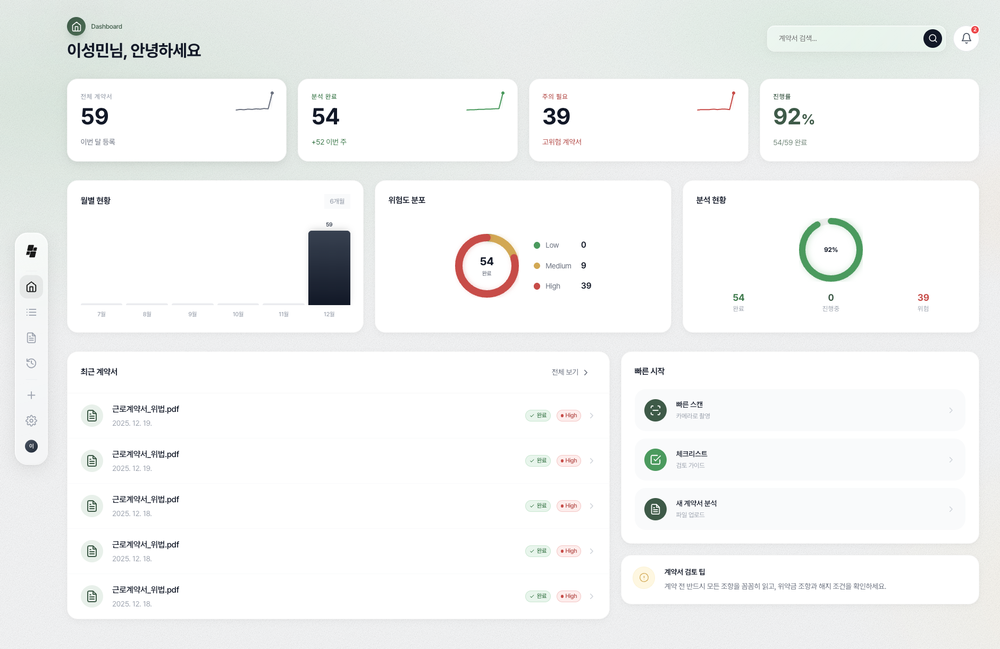 | 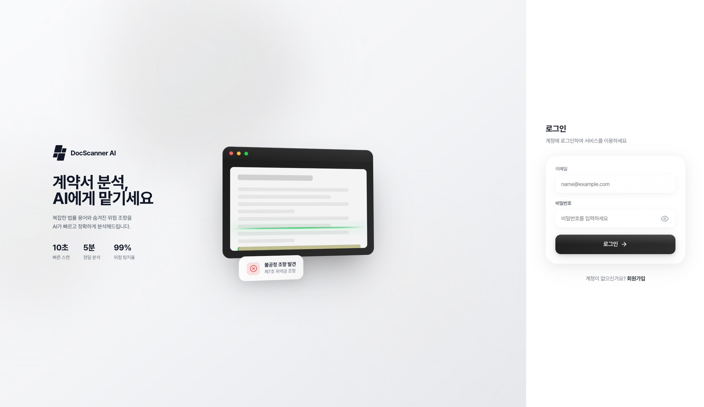 |

### 체크리스트

근로계약서 작성 전 필수 확인 항목을 체크리스트로 제공합니다.

<div align="center">
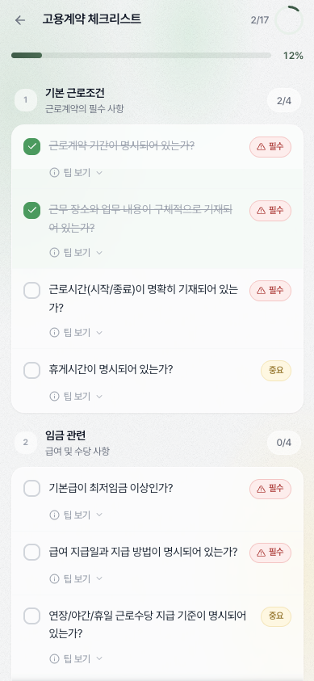
</div>

### Quick 스캔

| 스캔 중 | 스캔 완료 |
|---------|-----------|
| 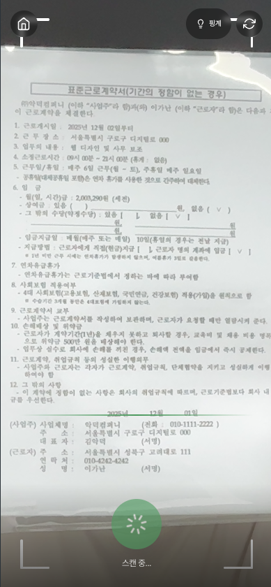 | 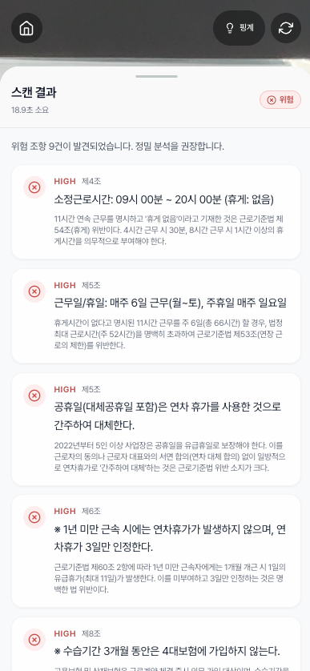 |

### 계약서 심층 분석 결과

**분석 결과 화면**

<div align="center">
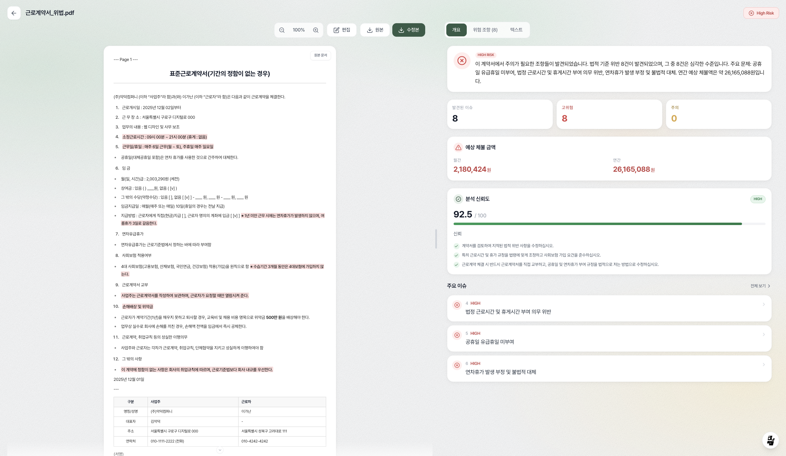
</div>

**위험 조항 토글 및 자동 하이라이팅**

<div align="center">
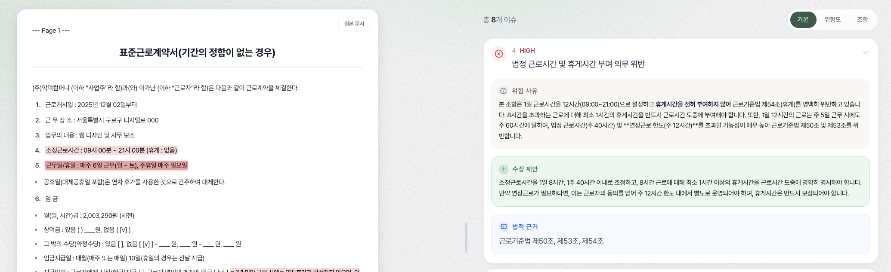
</div>

**수정안 모달 및 적용**

| 수정안 모달 | 수정안 적용 후 |
|-------------|----------------|
| 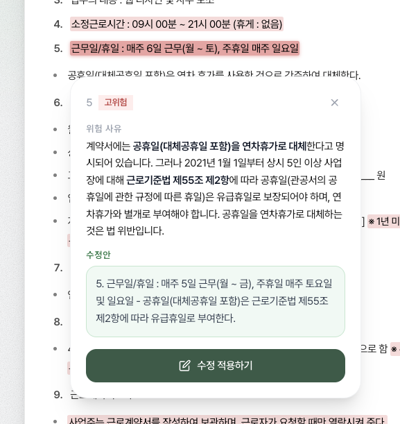 | 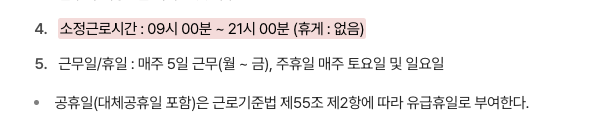 |

**버전 관리**

| 수정 시 자동 버전 관리 | 버전 히스토리 화면 |
|------------------------|---------------------|
| 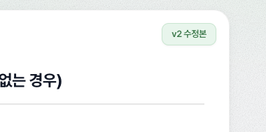 | 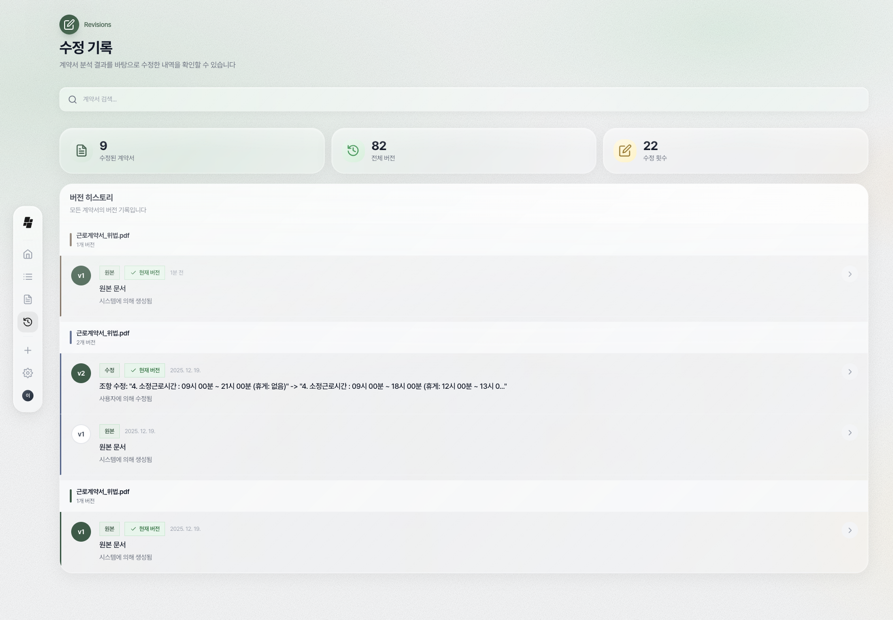 |

### AI 채팅 에이전트

본문에서 텍스트를 드래그하여 바로 질문할 수 있습니다.

| 드래그 후 질문 | 답변 중 | 답변 완료 |
|----------------|---------|-----------|
| 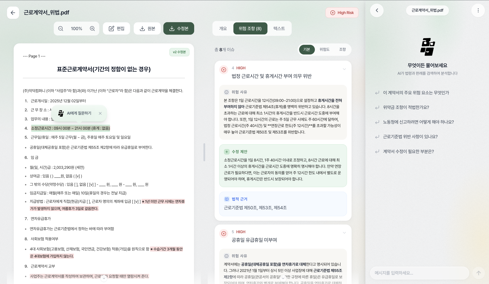 | 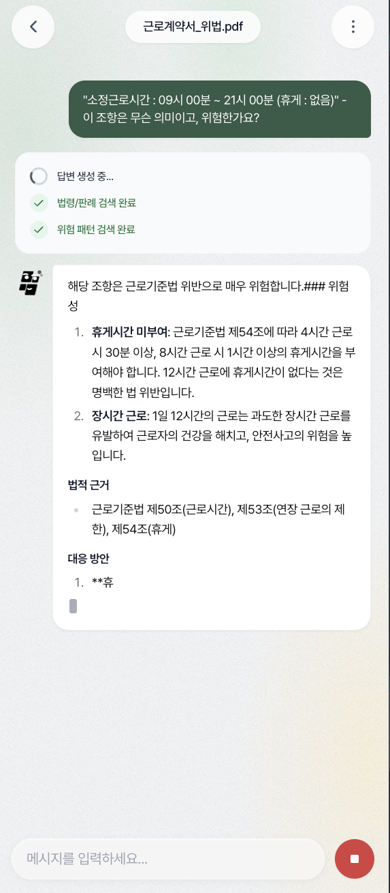 | 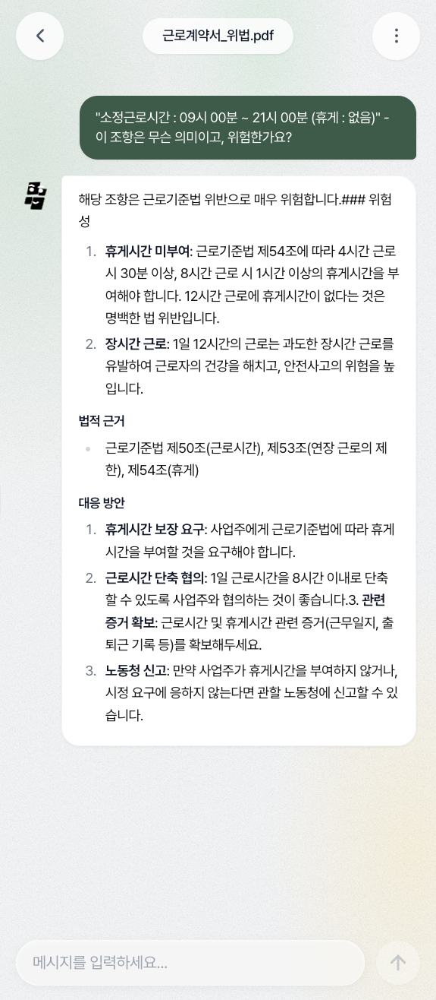 |

### 내용증명 자동 생성

<div align="center">
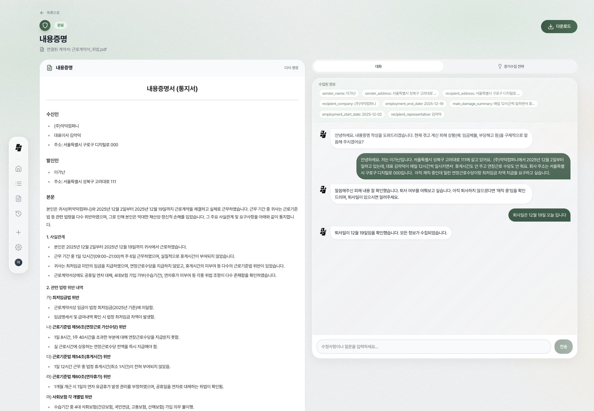
</div>

---

## 시스템 아키텍처

Frontend(Next.js)에서 Backend(FastAPI)로 요청이 전달되고, 12단계 AI Pipeline을 거쳐 분석 결과를 SSE 스트리밍으로 반환합니다.

<div align="center">

<p><i>Frontend - Backend - AI Pipeline - Data Layer 구조</i></p>
</div>

---

## 핵심 기술

### Hybrid RAG (Vector DB + Knowledge Graph)

Vector DB(Elasticsearch)와 Graph DB(Neo4j)를 결합한 하이브리드 검색으로 정확한 법적 근거를 제공합니다.

<div align="center">

</div>

| 구성요소 | 설명 |
|----------|------|
| **Vector DB (Elasticsearch)** | [MUVERA](#muvera-임베딩) 고정 차원 인코딩 적용으로 검색 속도와 성능 결합 |
| **Graph DB (Neo4j)** | 법령-판례-계약조항 간의 관계를 구조화한 Knowledge Graph 구축 |

**검색 흐름:**

1. **Vector DB Search**: 시급, 임금 등 키워드로 의미적 유사도 검색
2. **Graph DB Expansion**: 검색된 판례에서 CITES 관계를 따라 관련 법령/해석례 확장
3. **LLM Analysis**: Vector + Graph 결합 문서로 분석 수행

---

### MUVERA 임베딩

Google Research(NeurIPS 2024)의 [Multi-Vector Retrieval via Fixed Dimensional Encodings](https://arxiv.org/abs/2405.19504) 기술을 적용하여 긴 법률 문서의 세부 의미를 보존합니다.

<div align="center">

</div>

**처리 과정:**

1. **Article-based Chunking**: 계약서를 조항 단위로 분할
2. **Sentence Split + KURE-v1**: 문장별로 한국어 법률 특화 모델(KURE-v1)로 임베딩
3. **SimHash Partitioning**: Locality-Sensitive Hashing으로 유사 벡터를 같은 버킷에 할당
4. **FDE Compression**: Multi-vector를 단일 1024차원 벡터로 압축 (의미 보존)

> **Reference**: Laxman Dhulipala, Majid Hadian, Rajesh Jayaram, Jason Lee, Vahab Mirrokni. "Multi-Vector Retrieval via Fixed Dimensional Encodings." *NeurIPS 2024*.

---

### 계약서 분석 파이프라인

PII 마스킹된 데이터를 6단계 분석 파이프라인을 통해 처리합니다.

<div align="center">

</div>

| 단계 | 모듈 | 설명 |
|------|------|------|
| 1 | **ClauseAnalyzer** | 계약서에서 위험 조항 자동 추출. 내부 호출: HyDE + CRAG. Neuro-Symbolic: LLM + 수식 계산 |
| 2 | **HyDE** | 짧은 쿼리를 법률 문서로 확장. 가상 법률 의견서 생성(판례/법령/행정해석). 검색 정확도 +40% |
| 3 | **CRAG** | 문서 검색 후 관련성 평가 (HIGHLY_RELEVANT / RELEVANT / NOT_RELEVANT). 품질 낮으면 쿼리 재작성. 노이즈 제거 + 자가 보정 |
| 4 | **RAPTOR** | 계층적 요약 트리 구조. [루트] 전체 요약, [중간] 조항 그룹 요약, [리프] 각 개별 조항. Adaptive depth |
| 5 | **Constitutional** | 6대 노동법 원칙 준수 여부. 비판 + 수정. 근로자 보호 강화. 윤리 검증 |
| 6 | **LLM-Judge** | 5개 평가 지표 (정확성/일관성/완전성/관련성/법적근거). 가중치 적용. 팩트 체크 |

> **Reference**: Parth Sarthi, Salman Abdullah, Aditi Tuli, Shubh Khanna, Anna Goldie, Christopher D. Manning. "RAPTOR: Recursive Abstractive Processing for Tree-Organized Retrieval." *ICLR 2024*, Stanford University. [Paper Link](https://arxiv.org/abs/2401.18059)

---

### Neuro-Symbolic AI + Constitutional AI

LLM의 자연어 이해력과 Python의 정확한 수치 계산을 결합하고, 6가지 노동법 원칙으로 분석 품질을 보장합니다.

**Neuro-Symbolic AI:**

- **LLM (Neuro)**: 계약서에서 급여, 근로시간 등 정보 추출
- **Python (Symbolic)**: 정확한 수치 계산 및 법적 기준 비교
- **11가지 검증 항목**: 최저임금, 연장근로수당, 주휴수당, 연차휴가 등

**Constitutional AI:**

- **6가지 원칙**: Human Dignity, Worker Protection, Min Standard, Equality, Safety, Transparency
- **Critique - Revise 워크플로우**: 원칙 위반 시 자동 수정

---

## 성능 비교 평가

DocScanner 파이프라인 vs GPT-4o/Gemini 2.5 단순 프롬프팅 비교

| 평가 지표 | **DocScanner** | GPT-4o (Raw) | Gemini 2.5 (Raw) | 비고 |
|-----------|----------------|--------------|------------------|------|
| **위반 탐지 F1** | **0.498** | 0.402 | 0.383 | GPT 대비 +23.9% |
| **위반 탐지 Recall** | **0.743** | 0.552 | 0.527 | GPT 대비 +34.6% |
| **체불액 MAPE** | **~0%** | 33% | 24% | 오차율 0% (Neuro-Symbolic) |
| **체불액 MAE** | **~0원** | 415만 원 | 347만 원 | 오차 거의 없음 |
| **법률 인용 정확도** | **100%** | - | - | 정확한 법적 근거 제시 |
| **법률 환각률** | **0%** | - | - | 할루시네이션 없음 |

---

## 데이터 구축 현황

| 항목 | 수치 |
|------|------|
| **총 청크(Chunks)** | 15,223개 |
| **법령 데이터** | 847개 |
| **판례 데이터** | 2,100개 이상 |
| **그래프 노드** | 15,261개 |
| **그래프 엣지** | 1,357개 |
| **출처** | 국가법령정보 Open API (고용노동부, 법제처, 대법원) |

### Vector DB (Elasticsearch)

| 데이터 유형 | 문서 수 | 청크 수 |
|------------|--------|--------|
| 판례 (precedent) | 969 | 10,576 |
| 고용노동부 해설 (labor_ministry) | 1,827 | 3,384 |
| 법령해석례 (interpretation) | 135 | 589 |
| 업무 매뉴얼/가이드 (manual) | - | 674 |
| **합계** | **2,931+** | **15,223** |

### Graph DB (Neo4j)

**노드 유형:**

- Document, Precedent, Interpretation, Manual, Law
- Category, ClauseType (6종), RiskPattern (4종)

**관계 유형:**

- CATEGORIZED_AS, SOURCE_IS, IS_A_TYPE_OF
- HAS_CASE, HAS_INTERPRETATION, CITES

---

## AI 분석 파이프라인 (12단계)

| 단계 | 모듈 | 설명 |
|------|------|------|
| 1 | PII Masking | 개인정보 마스킹 (10종: 주민등록번호, 전화번호, 이메일 등) |
| 2 | Document Parsing | PDF, HWP, DOCX, 이미지 텍스트 추출 |
| 3 | Text Chunking | 텍스트 분할 및 전처리 |
| 4 | HyDE | 가상 문서 생성으로 검색 쿼리 강화 |
| 5 | CRAG | 품질 인식 검색 (8단계 품질 평가 + 7가지 교정 전략) |
| 6 | LLM Clause Analysis | 조항별 위반 분석 (병렬 처리 + 종합 분석) |
| 7 | RAPTOR | 계층적 요약 인덱싱 |
| 8 | Legal Stress Test | Neuro-Symbolic AI 기반 정량적 법적 검증 (11종) |
| 9 | Generative Redlining | 법적으로 안전한 수정안 자동 생성 |
| 10 | Constitutional AI | 6가지 노동법 원칙 기반 자기 비판 및 수정 |
| 11 | LLM-as-a-Judge | 5가지 차원의 신뢰도 평가 |
| 12 | Reasoning Trace | 추론 과정 시각화 (XAI) |

---

## 기술 스택

### Backend

| 기술 | 용도 | 버전 |
|------|------|------|
| FastAPI | REST API 프레임워크 | 0.121.3 |
| Celery | 비동기 작업 처리 | 5.5.3 |
| SQLAlchemy | ORM | 2.0.44 |
| Alembic | DB 마이그레이션 | 1.17.2 |
| LangGraph | AI 에이전트 프레임워크 | 0.2.0+ |
| LangChain | LLM 통합 | 0.3.0+ |
| OpenAI | GPT-4o API | 1.95.0 |
| Google Generative AI | Gemini API | 0.8.3 |
| Tavily | 웹 검색 API | 0.5.0+ |
| sentence-transformers | 임베딩 생성 | 5.1.2 |

### Frontend

| 기술 | 용도 | 버전 |
|------|------|------|
| Next.js | React 프레임워크 | 15.5.4 |
| React | UI 라이브러리 | 19.1.0 |
| TypeScript | 타입 안전성 | 5.x |
| Tailwind CSS | 스타일링 | 3.4.18 |
| Radix UI | UI 컴포넌트 | - |
| react-markdown | 마크다운 렌더링 | 9.0.1 |
| react-pdf | PDF 뷰어 | 10.2.0 |

### Infrastructure

| 기술 | 용도 | 포트 |
|------|------|------|
| PostgreSQL | 관계형 DB | 5435 |
| Elasticsearch | Vector DB | 9200 |
| Neo4j | Graph DB | 7474, 7687 |
| Redis | 캐시 & Celery 큐 | 6379 |
| Docker | 컨테이너화 | - |

---

## API 엔드포인트

### 인증 (Auth)

| Method | Endpoint | 설명 |
|--------|----------|------|
| POST | `/api/v1/auth/signup` | 회원가입 |
| POST | `/api/v1/auth/login` | 로그인 |
| POST | `/api/v1/auth/refresh` | 토큰 갱신 |
| POST | `/api/v1/auth/logout` | 로그아웃 |

### 계약서 (Contracts)

| Method | Endpoint | 설명 |
|--------|----------|------|
| POST | `/api/v1/contracts/` | 계약서 업로드 및 AI 분석 시작 |
| GET | `/api/v1/contracts/` | 내 계약서 목록 조회 (검색 지원) |
| GET | `/api/v1/contracts/{id}` | 계약서 상세 조회 |
| DELETE | `/api/v1/contracts/{id}` | 계약서 삭제 |

### AI 분석 (Analysis)

| Method | Endpoint | 설명 |
|--------|----------|------|
| POST | `/api/v1/analysis/stress-test` | Legal Stress Test - 수치 시뮬레이션 |
| POST | `/api/v1/analysis/redlining` | Generative Redlining - 수정 제안 |
| POST | `/api/v1/analysis/judge` | LLM-as-a-Judge - 신뢰도 평가 |
| POST | `/api/v1/analysis/pii-mask` | PII Masking - 개인정보 비식별화 |
| POST | `/api/v1/analysis/hyde` | HyDE - 검색 쿼리 강화 |
| POST | `/api/v1/analysis/constitutional-review` | Constitutional AI - 헌법적 검토 |
| GET | `/api/v1/analysis/contract/{id}/reasoning-trace` | Reasoning Trace - 추론 과정 시각화 |
| GET | `/api/v1/analysis/contract/{id}/analysis-detail` | 상세 분석 결과 조회 |
| GET | `/api/v1/analysis/pipeline-info` | 파이프라인 정보 조회 |

### AI 채팅 에이전트 (Agent Chat)

| Method | Endpoint | 설명 |
|--------|----------|------|
| POST | `/api/v1/agent/{contract_id}/stream` | SSE 스트리밍 채팅 |
| POST | `/api/v1/agent/{contract_id}/stream/history` | 대화 히스토리 포함 스트리밍 |
| POST | `/api/v1/agent/{contract_id}` | 동기 채팅 (fallback) |
| GET | `/api/v1/agent/health` | 에이전트 상태 확인 |

### 빠른 스캔 (Quick Scan)

| Method | Endpoint | 설명 |
|--------|----------|------|
| POST | `/api/v1/scan/quick` | 이미지 기반 빠른 위험 탐지 |
| GET | `/api/v1/scan/keywords` | 위험 키워드 목록 조회 |

### 내용증명 (Legal Notice)

| Method | Endpoint | 설명 |
|--------|----------|------|
| POST | `/api/v1/legal-notice/` | 내용증명 자동 생성 |
| GET | `/api/v1/legal-notice/{id}` | 내용증명 조회 |

---

## 프로젝트 구조

```
docscanner-ai/
├── ai/                           # AI/ML 전처리 모듈
│   ├── data/                     # 원본 데이터
│   └── preprocessing/            # 전처리 스크립트
├── backend/                      # FastAPI 백엔드
│   ├── app/
│   │   ├── api/v1/               # API 라우터
│   │   ├── ai/                   # AI 파이프라인 모듈
│   │   ├── core/                 # 핵심 설정
│   │   ├── models/               # SQLAlchemy 모델
│   │   ├── schemas/              # Pydantic 스키마
│   │   └── tasks/                # Celery 작업
│   ├── alembic/                  # DB 마이그레이션
│   └── logs/                     # 토큰 사용량 로그
├── frontend/                     # Next.js 프론트엔드
│   └── src/
│       ├── app/                  # 페이지
│       └── components/           # React 컴포넌트
├── images/                       # README 이미지
├── docs/                         # 프로젝트 문서
└── docker-compose.yml
```

---

## 프로젝트 실행

### 환경 설정

```bash
# 환경 변수 설정
cp backend/.env.example backend/.env
# .env 파일에 API 키 입력 (OPENAI_API_KEY, GOOGLE_API_KEY, TAVILY_API_KEY 등)
```

### Docker로 인프라 실행

```bash
docker-compose up -d
```

### Backend 실행

```bash
cd backend
pip install -r requirements.txt

# FastAPI 서버
uvicorn app.main:app --reload --port 8000

# Celery Worker (별도 터미널)
celery -A app.core.celery_app worker --loglevel=info
```

### Frontend 실행

```bash
cd frontend
npm install
npm run dev
```

브라우저에서 `http://localhost:3000` 접속

---

## 개발 환경 요구사항

- Python 3.10+
- Node.js 18+
- PostgreSQL 14+
- Elasticsearch 8.x
- Neo4j 5.x
- Redis 7.x
- Docker (권장)

---

## 기대 효과

- **사회적 가치**: 청년 및 청소년의 노동 권익 사각지대 해소 및 불공정 계약 예방
- **통합 지원**: 계약서 분석 - 내용증명 자동 생성 - 법률 상담까지 One-Stop 해결
- **확장성**: 검증된 Hybrid RAG 엔진을 기반으로 부동산(임대차), 용역 계약 등 타 법률 도메인 확장 가능

---

## 참여자

| 강민선 (Minsun Kang) - 팀장                                                                     | 이성민 (Seongmin Lee)                                                                           |
| ----------------------------------------------------------------------------------------------- | ----------------------------------------------------------------------------------------------- |
|  |  |
| [GitHub: @KangMinSun](https://github.com/KangMinSun)                                           | [GitHub: @danlee-dev](https://github.com/danlee-dev)                                           |
| 백엔드, AI/ML                                                                                   | 프론트엔드, AI/ML                                                                               |
| 고려대학교 컴퓨터학과                                                                           | 고려대학교 컴퓨터학과                                                                           |

---

## 라이선스

본 프로젝트는 교육 목적으로 개발되었습니다.

## 문의

프로젝트 관련 문의사항은 GitHub Issues를 통해 남겨주시기 바랍니다.

---

## References

- Laxman Dhulipala, Majid Hadian, Rajesh Jayaram, Jason Lee, Vahab Mirrokni. "[Multi-Vector Retrieval via Fixed Dimensional Encodings](https://arxiv.org/abs/2405.19504)." *NeurIPS 2024*, Google Research.
- Parth Sarthi, Salman Abdullah, Aditi Tuli, Shubh Khanna, Anna Goldie, Christopher D. Manning. "[RAPTOR: Recursive Abstractive Processing for Tree-Organized Retrieval](https://arxiv.org/abs/2401.18059)." *ICLR 2024*, Stanford University.
- "[Corrective Retrieval Augmented Generation (CRAG)](https://arxiv.org/abs/2401.15884)."
- "[Constitutional AI (Anthropic)](https://arxiv.org/abs/2212.08073)."
- [v1 개발 현황 상세 문서](docs/development/v1-development-status.md)
